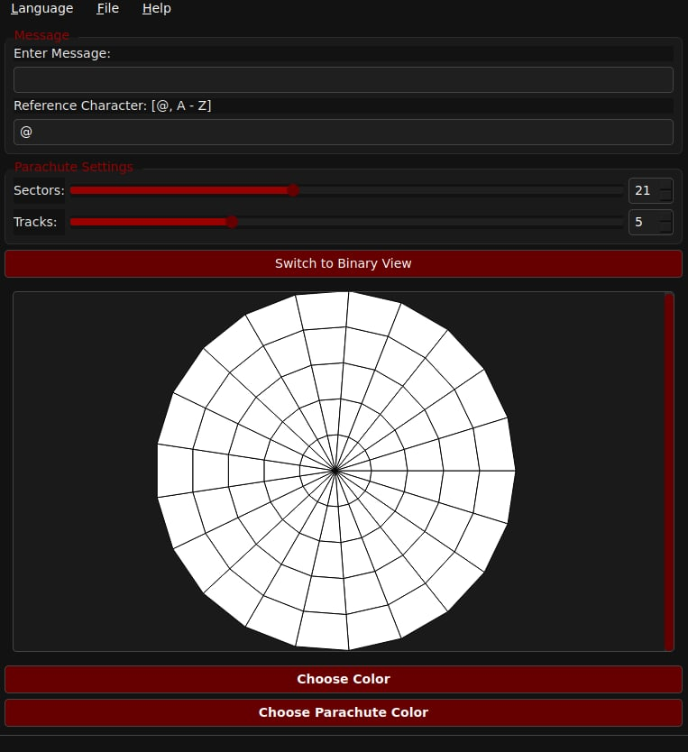

# ParachuteEncoder

ParachuteEncoder is a C++/Qt application developed as part of an academic project at ENSICAEN for the *Graphical Interface Conception* module. Inspired by NASA’s Perseverance rover parachute, the software allows encoding text messages into a visual pattern of trapezoids arranged across sectors and concentric tracks—mimicking the parachute design used during the Mars landing.

## Preview



---

## Features

- Encode any message using ASCII-64 binary encoding
- Configurable number of:
  - **Sectors** (radial divisions)
  - **Tracks** (concentric rings)
- Dual visual modes:
  - **Parachute View**: Displays encoded message as colored trapezoids
  - **Binary View**: Displays raw binary representation
- Interface translated into multiple languages (e.g., French/English)
- File saving and loading support for messages and layout settings
- Responsive GUI with sliders and spinboxes
- Optional enhancements like:
  - Custom color schemes
  - Marker sequences
  - Display in blocks of 10 trapezoids
  - Exportable configuration

---

## Installation

### Prerequisites
- Qt 5 or Qt 6 (tested with Qt 6.x)
- CMake (minimum version 3.16)
- C++17-compatible compiler

### Build Instructions

```bash
git clone https://github.com/1MrazorT1/ParachuteEncoder.git
cd ParachuteEncoder
mkdir build && cd build
cmake ..
make
./ParachuteEncoder
```

---

## Encoding Logic

- Each character is encoded as a 7-bit binary number, using ASCII value minus 64 (i.e., ```@ = 0```)
- A full message is segmented into blocks of 10(7 bits + 3 padding bits)
- The trapezoids are drawn clockwise from the center out, based on index, using polar geometry.

---

## Project Structure

```
 ParachuteEncoder/
 │
 ├── CMakeLists.txt
 ├── CMakeLists.txt.user
 ├── README.md
 ├── assets
 │   └── ParachuteEncoder.jpg
 ├── build
 ├── files.txt
 ├── include
 │   ├── ParachuteController.h
 │   ├── ParachuteModel.h
 │   ├── ParachuteView.h
 │   └── ui_parachute.h
 ├── resources.qrc
 ├── src
 │   ├── ParachuteController.cpp
 │   ├── ParachuteModel.cpp
 │   ├── ParachuteView.cpp
 │   ├── main.cpp
 │   ├── parachute.ui
 │   └── style.qss
 └── translations
     ├── parachute_fr.qm
     └── parachute_fr.ts
```